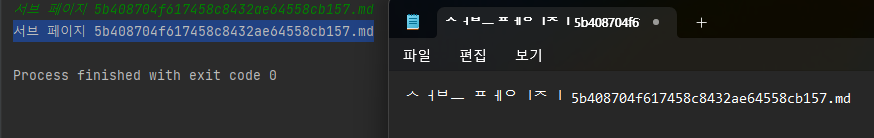
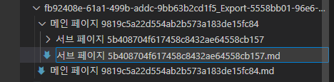
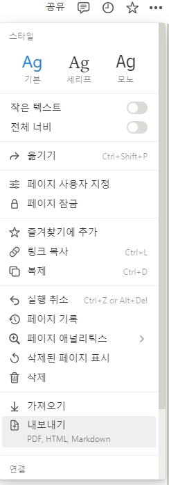
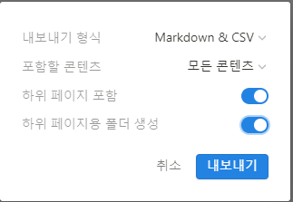
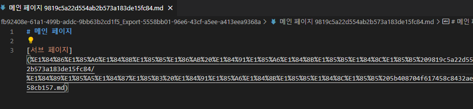
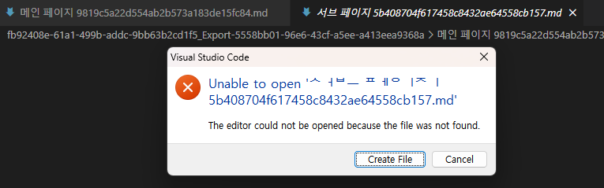
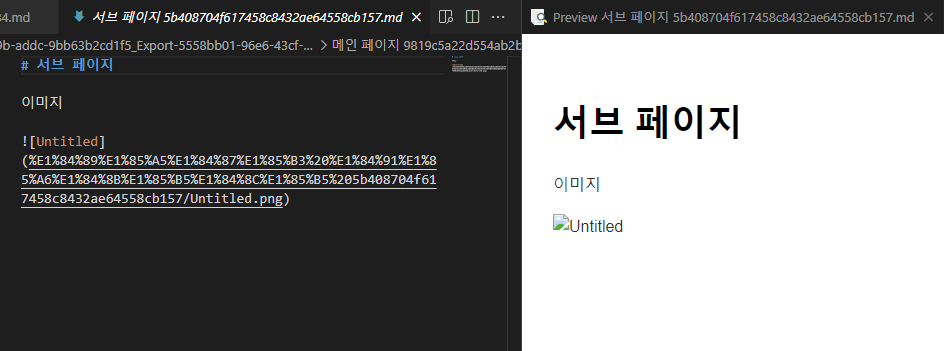

# 노션 내보내기 한글 폴더 경로 변환

페이지 링크 경로 및 이미지 링크 경로에 한글이 들어간 경우 링크가 제대로 되어있지 않은 현상을 해결하기 위한 프로그램입니다.

현재 최소한의 기능만 존재하며 지속적으로 업데이트 예정입니다.

## 현재 기능

링크 경로에 해당하는 폴더 또는 파일의 현재 명칭을 입력하면 노션에 입력한 경로에 맞게 명칭을 출력합니다.
- 한글 완성형 문자를 조합형 문자로 변형시킵니다.

## 추후 추가할 기능

- 특정 폴더 경로 내부에 해당하는 모든 링크 경로의 명칭을 알맞게 변경하는 기능
  - 현재는 직접 명칭을 하나하나 수작업으로 바꿔주어야 함.

## 사용 방법

입력값을 넣으면 해당 입력값에서 한글 부분은 조합형 문자로 바꾸어 출력하여 줍니다. (인텔리제이 출력에는 조합형 문자가 온전히 잘 보이지만 메모장으로 옮길 시 조합형 문자임을 확인 가능)

비주얼스튜디오코드(Visual Studio Code) 등의 프로그램을 통해 변경한 조합형 문자로 이름을 변경해줍니다.

## 문제 현상 예시

